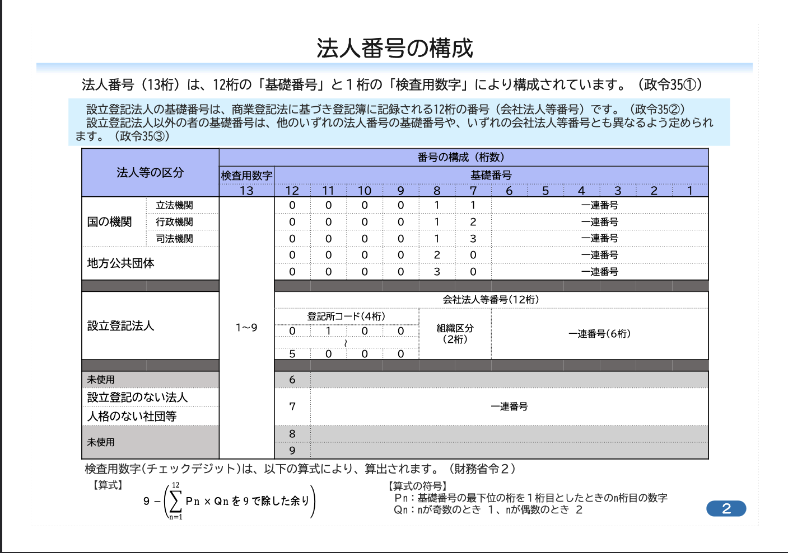

# houjin-number-util
Goで書かれた法人番号を生成・検証するためのライブラリです。

## インストール方法

```bash
go get github.com/tychy/houjin-number-util
```

## 使い方

```go
import "github.com/tychy/houjin-number-util/houjin"

// 法人番号の生成
randomNumber := houjin.Generate()                // ランダムな法人番号
govNumber := houjin.GenerateGovernmentHoujinNumber() // 政府機関
regNumber := houjin.GenerateRegisteredHoujinNumber() // 設立登記法人
nonRegNumber := houjin.GenerateNonRegisteredHoujinNumber() // 設立登記なし

// 法人番号の検証
err := houjin.ValidateHoujinNumber("1234567890123") 
if err == nil {
    // 有効な法人番号
}

// チェックディジットの計算
checkDigit, _ := houjin.CalculateCheckDigit("123456789012")
```

## 法人番号について

法人番号は12桁の基礎番号と1桁のチェックディジットで構成されています。

- 国の機関または地方公共団体
- 設立登記法人（株式会社など）
- 設立登記のない法人（健康保険組合など）
- 人格のない社団等（マンション管理組合など）



詳細は[国税庁のウェブサイト](https://www.houjin-bangou.nta.go.jp/documents/houjinbangounokousei.pdf)を参照してください。

## ライセンス
Apache2 License
