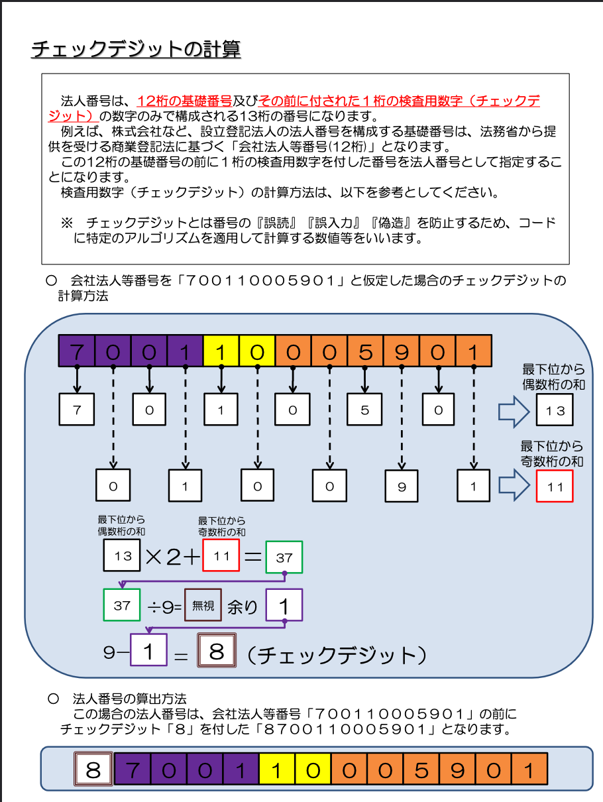

# houjin_number_util
[チェックディジットの計算](https://www.houjin-bangou.nta.go.jp/documents/checkdigit.pdf)を参考に実装



## 法人番号バリデーション
Validate関数を使用して、法人番号の検証を行うことができます。
```
err := Validate("1234567890123")
if err != nil {
    // エラー処理
}
```

## 法人番号の生成
```
houjinNumber := Generate()
fmt.Println(houjinNumber)
```


## チェックディジットの計算
CalculateCheckDigit関数を使用して、法人番号のチェックデジットを計算することができます。

```
checkDigit, err := CalculateCheckDigit("123456789012")
if err != nil {
    // エラー処理
}
fmt.Println(checkDigit)
```

## エラー

このパッケージでは、以下のエラーを定義しています。
```
    ErrInvalidCharacter: 法人番号に無効な文字が含まれている場合に返されます。
    ErrInvalidHoujinNumberLength: 法人番号の長さが無効な場合に返されます。
    ErrInvalidCheckDigit: チェックデジットが無効な場合に返されます。
```
