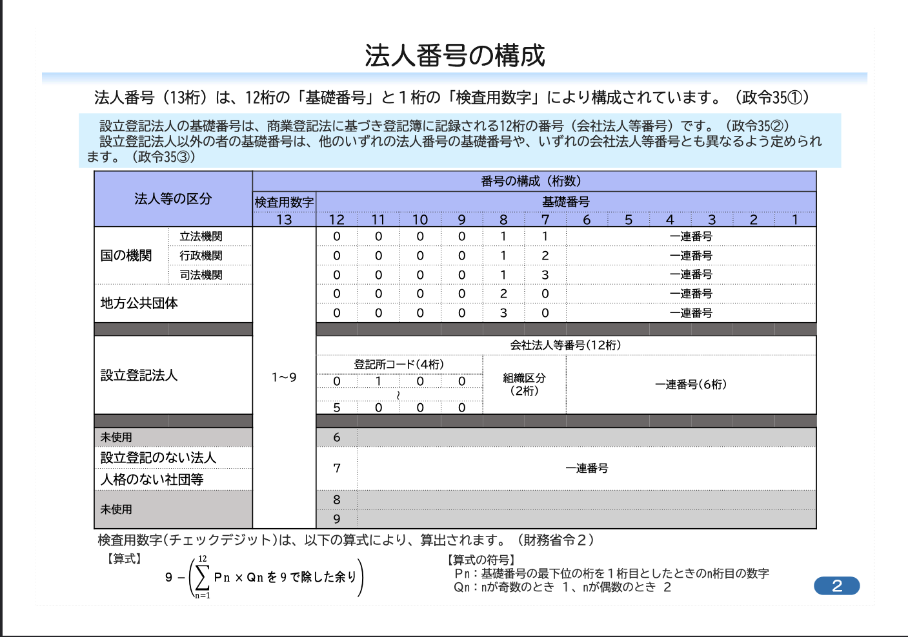

# houjin_number_util
Goで書かれた法人番号を生成するライブラリ

## 前提
法人番号は12桁の基礎番号と、その前に付された1桁のチェックディジット(検査用数字)で構成されている。

## 法人番号生成ロジック

法人番号の指定がされている法人には以下の4種類が存在します。

1. 国の機関又は地方公共団体
2. 設立登記法人(株式会社、合名会社、合資会社、合同会社、一般社団法人、一般財団法人など)
3. 設立登記のない法人(健康保険組合、土地改良区、企業年金基金、外国法人など)
4. 人格のない社団等(マンション管理組合、PTAなど)

{: width="500" height="300" }
[参考](https://www.houjin-bangou.nta.go.jp/documents/houjinbangounokousei.pdf)


### チェックディジット(検査用数字)計算ロジック
[チェックディジットの計算](https://www.houjin-bangou.nta.go.jp/documents/checkdigit.pdf)を参考に実装
{: width="500" height="300" }


## ご利用方法
### 法人番号バリデーション
Validate関数を使用して、13桁の法人番号の検証を行うことができます。
```
err := Validate("1234567890123")
if err != nil {
    // エラー処理
}
```

### 法人番号の生成
Generate関数を使用して、13桁の法人番号を生成できます。
```
houjinNumber := Generate()
fmt.Println(houjinNumber)
```


### チェックディジットの計算
CalculateCheckDigit関数を使用して、12桁の基礎番号に対してのチェックデジットを計算することができます。

```
checkDigit, err := CalculateCheckDigit("123456789012")
if err != nil {
    // エラー処理
}
fmt.Println(checkDigit)
```

### エラー定義

このパッケージでは、以下のエラーを定義しています。
```
    ErrInvalidCharacter: 法人番号に無効な文字が含まれている場合に返されます。
    ErrInvalidHoujinNumberLength: 法人番号の長さが無効な場合に返されます。
    ErrInvalidCheckDigit: チェックデジットが無効な場合に返されます。
```
## ライセンス
Apache2 License
